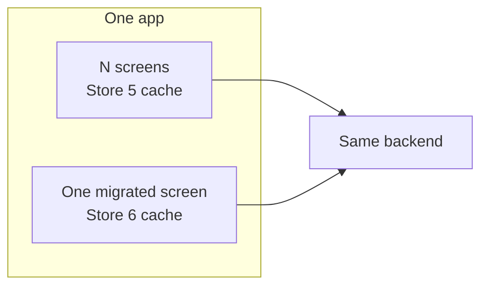

Store 6 is designed for incremental adoption. Keep Store 5 in the application, move one complete
screen to Store 6, and repeat. This guide translates the Store 5 read, persistence, and write
vocabulary without treating unlike behaviors as equivalents.

## No flag day

`store5.*` and `store6.*` coordinates live side by side for the whole 6.x major. You can depend on
both in one build and migrate a screen at a time.

Store 5 is not end-of-life. Its coordinates remain available throughout 6.x. Store 5 moves to
fixes-only maintenance at Store 6 GA, when a dated end-of-life will be published.

The promised `store6-store5-interop` artifact is supported for all of 6.x, but it tracks to 6.0.0
and is not part of the alpha01 line. Until it ships, treat the two stores as independent caches of
the same backend data. Move a complete screen rather than splitting one screen's fetch,
persistence, and read sites across the two versions.

<Callout type="Note">

This migration guide is a launch gate for 6.0.0, not a post-release follow-up. It will continue to
grow before GA. The Store 6 coordinates described here are not published yet. They begin with
6.0.0-alpha01.

</Callout>

<Callout type="Note">

**Initial scope.** This guide covers Kotlin callers using the coroutine APIs. RxJava (`rx2`) and
Java-first consumers are out of scope for the initial guide. The `rx2` module remains on Store 5
coordinates, which stay published for the whole 6.x major. This scope can be revisited when there
is demand for a dedicated path.

</Callout>

## What you already know that still holds

Store 5 models read failures as `StoreReadResponse.Error` values so a flow can keep observing its
source of truth. Store 6 keeps that split: `stream` emits `StoreResult.Error` and does not throw
retrieval failures to the collector. A `Freshness.MustBeFresh` failure in the initial cycle emits
one error and completes the flow. Other retrieval failures leave the flow live.

The fetcher-to-persistence round trip also remains. When persistence is installed, fetched values
are written through it and delivered back to collectors through its reader. Store 6 makes the
persistence contract stricter, but the source of truth remains the observable local authority.

Single-flight deduplication carries over as a named guarantee. Concurrent callers for one key
share one in-flight fetch, including callers using different Store 6 freshness policies.

## The builder, translated

The builder spelling changes from `StoreBuilder.from(...).build()` to the Store 6 DSL. An
illustrative Store 5 construction is:

```kotlin
val store5Users = StoreBuilder
    .from(fetcher = store5Fetcher, sourceOfTruth = store5SourceOfTruth)
    .build()
```

The compiled Store 6 quickstart block is:

{/* snippet: guides-fetchers-quickstart */}
```kotlin
val users = store<UserKey, User> {
    fetcher { key -> FakeApi.getUser(key.id) }
}
```

These blocks are not behaviorally equivalent because the Store 5 block installs a source of truth
while the Store 6 block uses its in-memory default. They show the construction syntax only.

A Store 6 fetcher is the one required builder input. Building without `fetcher { }`,
`fetcherOfResult { }`, or `fetcher(Fetcher)` throws `IllegalArgumentException`; installing a source
of truth does not replace that requirement.

Most expert doors are explicit seams. Persistence, durable freshness bookkeeping, telemetry,
overlay projection, a wall clock, and a custom freshness validator are `@ExperimentalStoreApi`.
`maxIdleKeys` is the stable non-fetcher knob.

Store 5 builder settings do not all have one-for-one replacements:

| Store 5 | Store 6 |
| --- | --- |
| `scope(...)` | No counterpart. A Store 6 store owns its lifecycle and is released with `close()`. After close, operations fail with `IllegalStateException("Store is closed.")`. |
| `cachePolicy(...)` / `disableCache()` | No TTL-style cache policy. `maxIdleKeys` bounds quiescent per-key engine residency; the default is 128 and `0` destroys each engine when it becomes quiescent. Durable rows, stale marks, and watermarks survive engine eviction. |
| `validator(...)` | Usually replaced by per-call `Freshness` plus durable invalidation. The experimental `FreshnessValidator` seam is a read planner, not a per-item validity hook. |

Keys change shape too. Store 5 accepts any non-null key. A Store 6 key implements `StoreKey` and
supplies both a `namespace` and `canonicalId()`. Together those fields form the durable identity.
Read [Keys and namespaces](/docs/store6/key-design) before moving persisted data or invalidation
rules.

## Translating reads: StoreReadRequest to Freshness

Store 5 puts cache and fetch choices in `StoreReadRequest`. Store 6 puts a `Freshness` policy on
each `stream` or `get` call. Calls with different policies still share one in-flight fetch for the
same key. The sealed policy has exactly five variants: `CachedOrFetch`, `MaxAge`, `MustBeFresh`,
`StaleIfError`, and `LocalOnly`.

| Store 5 request | Store 6 translation |
| --- | --- |
| `StoreReadRequest.cached(key, refresh = false)` | Nearest translation: `stream(key)` or `get(key)` with the default `Freshness.CachedOrFetch`. It still fetches when nothing is local, but it may also serve and background-revalidate invalidated or metadata-less local residence. |
| `StoreReadRequest.fresh(key)` | Nearest translation: `Freshness.MustBeFresh`. It withholds residence and blocks for a fresh fetch. Store 5 can emit `NoNewData` when its fetcher flow is empty; Store 6 has no empty-flow fetcher outcome, and a failed `MustBeFresh` read emits `StoreResult.Error` carrying a structured `StoreError` from `stream` or throws `StoreException` from `get`. |
| `StoreReadRequest.localOnly(key)` | `Freshness.LocalOnly`. It never invokes the fetcher, probes persistence once on a memory miss, and reports `StoreError.Missing` when nothing is local. |
| `StoreReadRequest.fresh(key, fallBackToSourceOfTruth = true)` | The nearest policy is `Freshness.StaleIfError`: prefer a fresh result, then return the stale local value if fetching fails. This is not an exact behavioral equivalence. |
| `StoreReadRequest.cached(key, refresh = true)` | No single policy. For pull-to-refresh, call `invalidate(key)` and keep collecting the default stale-while-revalidate stream. |
| `StoreReadRequest.skipMemory(key, refresh)` | No equivalent. Store 6 does not expose per-call skipping of individual storage layers. |

The [freshness guide](/docs/store6/concepts/freshness) defines all five policies and the exact
fetch conditions. [Invalidate or clear](/docs/store6/invalidate-vs-clear) covers refresh initiated
by the caller.

## Translating results: StoreReadResponse to StoreResult

Store 5 exposes `Initial`, `Loading`, `Data`, `NoNewData`, and three error shapes. Store 6 has
exactly four result kinds:

| Store 5 | Store 6 |
| --- | --- |
| `Initial` / `Loading` | `Loading` when demand exists and no value is servable. There is no separate `Initial` kind. |
| `Data(value, origin)` | `Data(value, origin, age, isStale, refreshing)`. |
| `NoNewData` | No direct analog. It means a Store 5 fetcher flow completed without data. |
| `Error.Exception`, `Error.Message`, `Error.Custom` | `Error(error: StoreError, servedStale)`, using the six structured `StoreError` variants. |
| No Store 5 analog | `Revalidated(age)`, the not-modified result of a conditional fetch. It clears staleness without emitting redundant `Data`. |

The origin vocabulary translates as follows:

| Store 5 origin | Store 6 origin |
| --- | --- |
| `Cache` | `MEMORY` |
| `SourceOfTruth` | `SOT` |
| `Fetcher(name)` | `FETCHER` |
| No direct analog | `OVERLAY`, an optimistic projection above committed data |

`StoreResult.Data` adds `age`, `isStale`, and `refreshing`, so UI can distinguish residence,
staleness, and active refresh without inferring them from emission order. `StoreResult.Error` adds
`servedStale`, which is true when a stale resident value was served and its refresh then failed
under a stale-tolerant policy.

Store 5 helpers such as `requireData()`, `dataOrNull()`, and `throwIfError()` do not carry over.
Store 6 separates the two doors: `get` returns a value or throws `StoreException`; `stream` emits
results and does not throw retrieval failures.

Handle the four stream kinds exhaustively:

{/* snippet: migration-store-result-when */}
```kotlin
when (result) {
    is StoreResult.Loading -> println("Loading…")
    is StoreResult.Data -> println("Data(name=${result.value.name}, origin=${result.origin})")
    is StoreResult.Revalidated -> println("Revalidated(age=${result.age})")
    is StoreResult.Error -> println("Error(${result.error})")
}
```

See the [read contract](/docs/store6/concepts/read-contract) and
[error handling](/docs/store6/concepts/errors) for completion and failure semantics.

## What Store 6 now does for you

The default Store 6 engine names and tests behavior that Store 5 callers often assembled or
inferred:

- Zero configuration and explicit expert configuration are tested as byte-identical in behavior
  across persistence, bookkeeper, freshness validator, and the idle cap. The equivalence does not
  cover telemetry or overlay, which are unset on both sides.
- Native freshness planning replaces common custom validity checks without requiring a custom
  `Validator` for each store.
  Invalidated residence stays visible while exactly one background revalidation runs under the
  default policy.
- One demand cycle invokes the fetcher once. Store performs no retry, backoff, or fallback chain;
  those policies belong inside your fetcher.
- Idle engine residency is bounded at 128 keys by default. Active collectors and in-flight work
  are never evicted.
- Durable invalidation tracks per-key stale marks plus namespace and global watermarks, including
  keys a fresh Store instance has not read yet.
- Fifty getters and fifty collectors for one key share exactly one fetch in the conformance suite.

Read [Important defaults](/docs/store6/important-defaults) for the named guarantees and
[Memory and lifecycle](/docs/store6/concepts/memory-and-lifecycle) for the eviction boundary.

## Maintenance calls: where clear habits go

Store 5 exposes `clear(key)` and `clearAll()` for removal. Store 6 splits maintenance into two
families:

- `invalidate`, `invalidateNamespace`, and `invalidateAll` mark data stale, preserve residence,
  and signal live streams to refresh.
- `clear`, `clearNamespace`, and `clearAll` destructively remove values and their associated
  per-key freshness records. Namespace and global watermarks remain conservative and are not reset
  by forget operations. A post-clear stream never replays pre-clear data.

Use the shortest decision test: if the value is wrong to show, clear it. If it is merely imperfect
or old, invalidate it.

## Where MutableStore users go

<Callout type="Note">

`store6-mutations` is a separate experimental artifact. Every public symbol carries
`@ExperimentalStoreApi`, so its shapes may change or be removed in any release. It is part of the
alpha01 floor. The first graduation review is at 6.1 and the target window is roughly 6.3, but
graduation requires an unchanged API across two consecutive minors, green crash-matrix and soak
lanes in production-representative apps, and reports from at least three external production
adopters. It never happens because a date arrived. See [Stability](/docs/store6/stability) before
adopting it.

</Callout>

`mutationStore(...)` returns a `MutationStore`, which implements `Store`. Its read, freshness,
invalidation, clear, and close behavior therefore follows the Store 6 read contract.

The write vocabulary is different:

- Register named, typed intent shapes once in a `MutatorRegistry`.
- Enqueue one with `mutate(key, ref, args)`, which returns an opaque mutation id but does not push.
- Push one foreground pass with `drain(key)` or `drain()`.
- Inspect durable truth with `pending(key)`, `pendingWrites()`, and `deadLetters()`.

{/* snippet: mutations-overview-build-and-drain */}
```kotlin
@OptIn(ExperimentalStoreApi::class)   // required: the whole module is experimental
val users = mutationStore(
    registry = registry,
    server = server,
    // Restart-safe key recovery is compile-time required. For keys reconstructible from the
    // identity pair, the resolver is one line:
    keyResolver = MutationKeyResolver { identity -> UserKey(identity.canonicalId) },
    valueCodecVersion = 1,
    valueCodec = userJsonCodec,
) {
    fetcher { key -> api.load(key) }
}

users.mutate(key, renameRef, Rename("new name"))   // journalled — the only write path
users.drain(key)                                   // push pending intents and adopt each ack
```

Optimistic values appear only on `stream`, with `origin == Origin.OVERLAY`, `age = Duration.ZERO`,
and `isStale = false`. `get` remains a point read of committed truth. Drive pending-write UI from
the origin, never `isStale`. Calling `runtime()` on a mutation store returns `null`, so consumer
writes cannot bypass the journal through the raw engine write handle.

The server contract requires idempotency. If remote acceptance happens before the local
acknowledgement-receipt transaction commits, the durable phase remains `INFLIGHT`; a later drain
may replay the same immutable generation and idempotency key. Once `ACKED` is durable, recovery may
repeat local adoption, effects, and retirement, but it never calls `MutationServer.push` again for
that generation.

Start with [Mutations](/docs/store6/mutations), the
[mutations quickstart](/docs/store6/mutations/quickstart), and the
[pending-write UI guide](/docs/store6/mutations/pending-write-ui). The
[component map](/docs/store6/migration/component-map) translates the Store 5 write assembly row by
row.

## A screen at a time: the recipe

1. Keep the Store 5 dependency and working screen in place.
2. Add the Store 6 dependencies needed by one screen.
3. Design its `StoreKey`. The namespace is what you invalidate together; `canonicalId()` includes
   everything that can make the returned bytes different. See
   [Keys and namespaces](/docs/store6/key-design).
4. Port the fetcher. Put retries and fallback policy inside it. See
   [Fetchers](/docs/store6/guides/fetchers).
5. Wire persistence through the seam or an adapter. See
   [Persistence](/docs/store6/guides/persistence), [Room](/docs/store6/room), and
   [SQLDelight](/docs/store6/sqldelight).
6. Translate collection and point-read sites with the request and result tables above.
7. Delete that screen's Store 5 store, then repeat for the next screen.

Until `store6-store5-interop` ships, the Store 5 and Store 6 instances do not share cache state.
Both can use the same backend, but invalidation and residence in one version do not update the
other.



## What to read next

- [Store 5 component to Store 6 map](/docs/store6/migration/component-map)
- [Migrating from Store 4](/docs/store6/migration/from-store4)
- [Read contract](/docs/store6/concepts/read-contract)
- [Freshness policies](/docs/store6/concepts/freshness)
- [Testing Store](/docs/store6/guides/testing)

---

*Last verified: 2026-08-12 · `main` @ `c67a94ed`, pre-6.0.0-alpha01*
