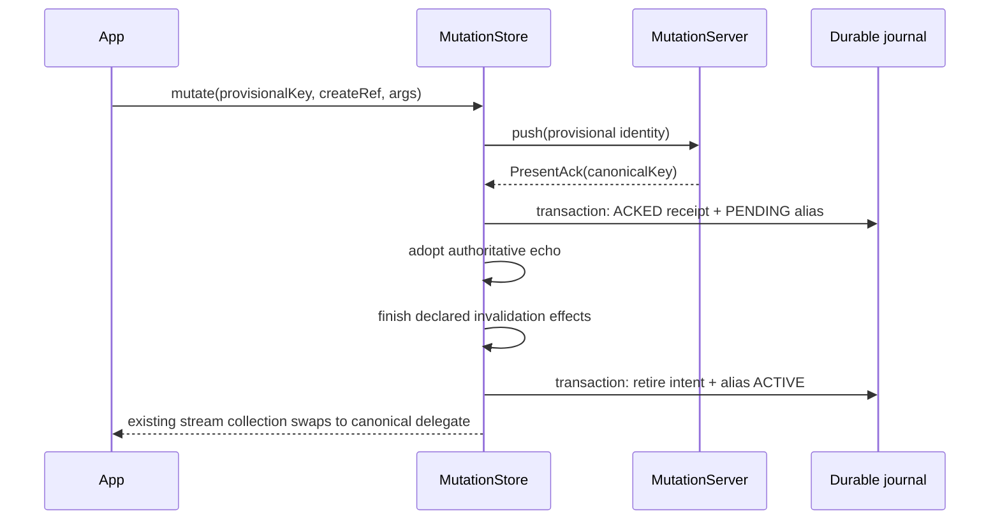

An optimistic create starts under a provisional, client-generated identity. A successful server
acknowledgement can name the entity's canonical identity; the mutation store then routes operations
on the provisional key to that canonical target once the redirect activates. This page describes
what the app observes while that redirect becomes durable and live.

<Callout type="Note">

**Experimental tier.** `store6-mutations` is a separate artifact in the 6.0.0-alpha01 floor, and
every public symbol carries `@ExperimentalStoreApi`. Its shapes may change or be removed in any
release. Read the [stability policy](/docs/store6/stability) before adopting it.

</Callout>

## Why an identity changes

The only rekey channel is `MutationPresentAck.canonicalKey`. It is an optional, same-namespace
redirect on a confirmed-present outcome. `null` preserves the identity that was pushed. There is
no client-side rekey operation.

A confirmed deletion cannot rekey by construction: `MutationAbsentAck` has no canonical-key
property, and a durable acknowledgement record rejects a canonical target unless the authoritative
outcome is present.

The create registration, enqueue, and acknowledgement fit together like this. The app types and
codecs are abbreviated, but the Store signatures are complete:

{/* snippet: mutations-alias-provisional-create */}
```kotlin
lateinit var createUser: MutatorRef<UserKey, User, NewUser>

val registry = mutatorRegistry<UserKey, User> {
    createUser =
        create(
            id = "create-user",
            version = 1,
            codec = newUserCodec,
            stales = { _, _ -> StaleSet(keys = emptySet(), namespaces = emptySet()) },
            project = { args -> User(id = args.id, name = args.name) },
        )
}

suspend fun createProvisionalUser(
    users: MutationStore<UserKey, User>,
    provisionalKey: UserKey,
): String =
    users.mutate(
        key = provisionalKey,
        ref = createUser,
        args = NewUser(id = provisionalKey.canonicalId(), name = "Ada"),
    )

override suspend fun push(
    request: MutationPush<UserKey, User>,
): MutationAck<UserKey, User> {
    val serverUser: User = createOnBackend(request)
    return MutationPresentAck(
        authoritative = serverUser,
        etag = null,
        canonicalKey = UserKey(serverUser.id),
    )
}
```

The string returned by `createProvisionalUser` is an opaque mutation correlation value, not the
entity identity. A retry of one generation's idempotency key must return the same canonical target;
a different target is a protocol violation and parks the intent. The
[server contract](/docs/store6/mutations/server) owns the full acknowledgement and idempotency
rules. Start with the [mutation quickstart](/docs/store6/mutations/quickstart) if this is your first
enqueue.

## The durable alias edge

A canonical redirect is stored as a `MutationKeyAliasRecord`. It is a same-namespace edge with two
states: `PENDING` and `ACTIVE`. Store does not persist cross-namespace redirects or self-edges, and
`activatedAt` is present exactly when the edge is `ACTIVE`.

The `PENDING` edge and the acknowledgement receipt are inserted in one journal transaction. The
edge advances to `ACTIVE` in retirement finalization, after every declared invalidation effect for
the intent has reached a terminal disposition. A live facade stream changes delegates at that
activation boundary, not merely when the acknowledgement arrives.



<Callout type="Note">

**Acknowledgement receipt and retirement are separate durable steps.** The pending alias,
acknowledgement receipt, and `ACKED` phase commit in one local transaction before Store adopts the
echo. Remote acceptance followed by process death before that local ack-receipt transaction
commits leaves the intent `INFLIGHT`; restart may replay the same immutable generation with the same
idempotency key. Once the receipt is durable, restart may repeat adoption, effect application, or
retirement finalization, but it does not re-push that generation. Make the endpoint idempotent or
key it by mutation identity.

</Callout>

Durable identity is exactly the string pair `(namespace.value, canonicalId())`. It is never object
identity, a hash, or the key's class. Ordinary journal pruning does not remove pending or active
alias edges, so a redirect survives restart for as long as its journal database does. The
[journal storage contract](/docs/store6/mutations/journal-storage) describes those records and
prune bounds.

## Every key-taking operation resolves the terminal identity first

The `MutationStore` facade follows active alias edges before it delegates. If the supplied identity
is already terminal, Store uses that key as given and does not call the resolver. If an active alias
points elsewhere, the required `MutationKeyResolver` reconstructs a key from the exact durable
pair; Store rejects a returned key whose namespace or canonical ID differs.

For keys that are reconstructible from the identity pair, the resolver can be one line:

{/* snippet: mutations-alias-key-resolver */}
```kotlin
val keyResolver = MutationKeyResolver<UserKey> { identity ->
    UserKey(identity.canonicalId)
}
```

That resolver is lawful only when `UserKey(identity.canonicalId)` also produces exactly
`identity.namespace`. Store validates both components verbatim.

| Operation | Behavior when the supplied key is aliased |
| --- | --- |
| `stream(key)` | Collects the terminal delegate, swaps after a later activation, and waits for a newer resolution signal after one conversion-error frame. |
| `get(key)`, `invalidate(key)`, `clear(key)` | Makes one resolution attempt, then throws the sanctioned conversion-backed `StoreException` on failure. |
| `mutate(key, ref, args)` | Resolves before append; a failure creates no intent. |
| `pending(key)` | Follows durable identity pairs without reconstructing a key, so key-resolver failure is impossible. |
| `drain(key)` | Owns the terminal identity and re-homes the pass if an alias activates during it. |

### Suspending reads and maintenance make one attempt

`get`, `invalidate`, and `clear` attempt alias resolution once. A `null`, thrown failure, or
identity mismatch becomes a `StoreException` carrying `StoreError.Conversion`. `get` remains an
unprojected point read: mutation overlays apply only to `stream`.

`mutate` resolves before it appends, so the durable row is written at the effective identity and
queued siblings merge by durable client sequence. A failed resolution cannot leave a partial
intent. Keyed `drain` likewise starts at the terminal identity; if activation occurs during the
pass, ownership moves to the canonical identity before adoption continues.

### Inspection follows identity pairs, not keys

`pending(key)` follows the durable alias pairs directly. It does not reconstruct a `K`, does not
consult `MutationKeyResolver`, and therefore cannot fail because a canonical key is
unreconstructible. See [inspection](/docs/store6/mutations/inspection) for the returned phases and
[drain and restart](/docs/store6/mutations/drain-and-restart) for pass ownership.

Only the `MutationStore` facade provides this alias guarantee. A raw `Store` reference or another
object graph that happens to hold the provisional key does not follow the mutation alias table.

## What a live stream does at activation

`stream(key)` first resolves and collects the current terminal delegate stream. If a later alias
activation redirects that identity, an alias-revision guard interrupts the old delegate
collection, resolves again, and collects the canonical delegate. The app keeps the same outer
`Flow` collection; subsequent data frames carry the canonical identity's data, although
`StoreResult` itself has no identity field.

### Resolver failure emits one error frame, then waits

If the resolver returns `null`, throws, or reconstructs a mismatched identity, the stream emits
exactly one `StoreResult.Error` with the conversion error and `servedStale = false`. It never falls
back to the provisional delegate and does not complete. Instead, it waits for a strictly newer
resolution signal for that identity and then retries.

A later alias activation or an explicit non-stream facade resolution attempt advances that signal.
The stream's own failed attempt does not. Starting a new collection makes an immediate attempt.
Calling `close()` wakes a waiting collector promptly and releases the retry subscription.

<Callout type="Info">

**Alias resolution keeps Store's one-failure-channel rule.** A stream reports the conversion error
as a `StoreResult.Error` value. A suspending operation throws a conversion-backed `StoreException`.
Neither failure crosses into the other channel.

</Callout>

### Designing provisional-key UX

Collect the provisional key continuously; do not cancel and restart merely because the backend
assigned a canonical ID:

{/* snippet: mutations-alias-stream-rekey */}
```kotlin
// Keep this one collection across provisional and canonical delegates.
users.stream(provisionalKey).collect { result ->
    when (result) {
        is StoreResult.Loading -> showLoading()
        is StoreResult.Data ->
            renderUser(
                user = result.value,
                saving = result.origin == Origin.OVERLAY,
            )
        is StoreResult.Revalidated -> showRevalidated(result.age)
        // A resolver conversion failure is one value; this collection remains live.
        is StoreResult.Error -> showReadError(result.error)
    }
}
```

Before activation, data can come from the provisional delegate and its optimistic projection.
Activation swaps that same collection to the canonical delegate. If reconstruction fails, the
single error frame described above replaces delegation until a newer signal allows another
attempt.

<Callout type="Note">

Pending-write affordances still key on `origin == Origin.OVERLAY`, never `isStale`. Rekeying does
not change that rule: `isStale` describes committed-value freshness, not an optimistic write.

</Callout>

Do not persist or navigate on the provisional `canonicalId` captured at enqueue. After activation,
facade calls made with the provisional key reroute, and inspection reports rows at the effective
identity. Treat the durable identity pair as authority.

There is no dedicated rekey event to observe. `keyEvents` has no `Rekeyed` variant, and the
advisory `MutationEvent` hierarchy has no alias variant. Observe the stream swap and durable
inspection instead. The [pending-write UI guide](/docs/store6/mutations/pending-write-ui) covers
overlay affordances, while the [read contract](/docs/store6/concepts/read-contract) explains the
error-as-value stream rule.

## Tombstones: where journal replay stops

A confirmed deletion, `MutationAbsentAck`, writes a `PENDING` tombstone for the effective identity
in the same journal transaction as its acknowledgement receipt. The tombstone activates at
retirement. Its three possible states are `PENDING`, `ACTIVE`, and `SUPERSEDED`.

During restart replay, Store excludes entries at or below the highest `ACTIVE` tombstone sequence
created by the same client for the terminal identity. In practical terms, intents journalled before
a confirmed deletion do not push again after restart.

Delete-then-recreate remains possible. When a later intent for the same identity retires, its
retirement transaction supersedes the active tombstone; a `SUPERSEDED` tombstone no longer bounds
replay. Ordinary pruning does not remove pending or active tombstone generations.

A tombstone stops journal replay only. It cannot hide a backend that violates deletion coherence:
every fetch begun after an Absent acknowledgement must return `FetcherResult.Deleted`. The
[server contract](/docs/store6/mutations/server) owns that backend obligation. See
[invalidate versus clear](/docs/store6/invalidate-vs-clear) for the clear semantics used to adopt
confirmed absence.

## What this page deliberately does not cover

- Canonical-key stability, idempotency, conflict signalling, and deletion coherence belong to the
  [server contract](/docs/store6/mutations/server).
- Durable phases and dead letters belong to
  [inspection](/docs/store6/mutations/inspection).
- Alias and tombstone storage conformance belongs to
  [journal storage](/docs/store6/mutations/journal-storage) and
  [mutation testing](/docs/store6/mutations/testing).

---

*Last verified: 2026-08-12 · `main` @ `539614c0`, pre-6.0.0-alpha01*
