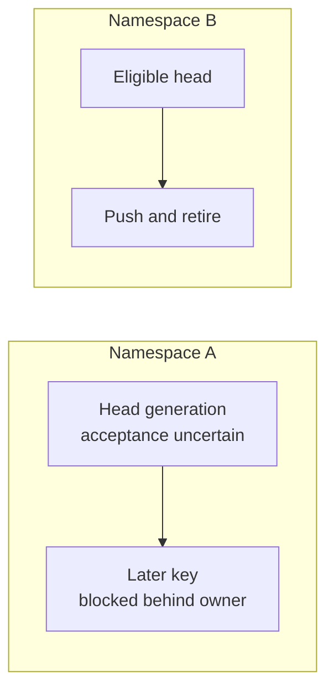

> Store 6 is in development and **nothing is published yet**. This page is the shape of the API as
> it stands on `main`; the install coordinates land with 6.0.0-alpha01.

<Callout type="Note">

**Experimental tier.** `store6-mutations` is a separate artifact in the 6.0.0-alpha01 floor, and
every public symbol carries `@ExperimentalStoreApi`. Its shapes may change or be removed in any
release. Read the [stability policy](/docs/store6/stability) before adopting it.

</Callout>

<Callout type="Note">

**A mutation endpoint must tolerate a re-sent push.** Remote acceptance followed by process death
before the local ack-receipt transaction commits leaves the intent `INFLIGHT`; restart
may replay the same immutable generation with the same idempotency key. Once the receipt is durable,
restart may repeat adoption, effect application, or retirement finalization, but it does not re-push
that generation. Make the endpoint idempotent, or key it by mutation identity. The
[server guide](/docs/store6/mutations/server) defines the full acknowledgement contract.

</Callout>

## What a drain is

`drain(key)` runs one idempotent foreground pass for the key's terminal canonical identity. It
captures the unprojected confirmed base, then pushes the pending prefix once in durable
client-sequence FIFO order. The pass does not fetch, retry a failed push, or wait for backoff.

`drain()` is the global form. It takes a snapshot of the durable identities in the journal,
reconstructs each key through the resolver, and validates the returned namespace and canonical id.
If an identity cannot be resolved, Store records an `IDENTITY` failure. For an affected pre-ack
head, it durably parks that head and continues with other identities. Within an effective identity,
processing is deterministic by durable client sequence. There is no promised order across keys.

<Callout type="Note">

**Store does not include a background scheduler.** Call `drain(key)` or `drain()` from your own
foreground, connectivity, or application-owned worker triggers. Each call is a bounded foreground
pass; it does not start a retry loop.

</Callout>

## Namespace ownership

Once transport becomes possible or its result is uncertain, that execution owns its
`(clientId, namespace)` lane until it parks or retires. A keyed drain for another key in the same
namespace returns without transport. Work in another namespace remains eligible to progress.

This rule matters after cancellation: once a generation is `INFLIGHT`, remote acceptance may be
unknown. The next explicit drain or restart must resend that exact immutable generation before a
later key in the same namespace can reach transport.



The ordering unit is the durable client sequence within one effective identity. Namespace
ownership prevents causal leapfrogging after transport begins; it does not create a global order
between unrelated keys.

## Durable identity and the resolver

A key's durable identity is exactly `(namespace.value, canonicalId())`. Hashes, object identity,
and the key's Kotlin class are not durable identity. See [Designing keys](/docs/store6/key-design)
for the corresponding `StoreKey` contract.

`MutationKeyResolver<K>` is a required `mutationStore` input because a global drain after restart
must reconstruct a process-local key from that pair. Its `resolve` function is suspending, may do
I/O, and is never invoked while the journal transaction is held. `CancellationException` is always
re-thrown.

For an identity-reconstructible key, the resolver can be one expression. For an app-owned catalog,
map lookup naturally returns `null` when the pair is unknown:

{/* snippet: mutations-restart-key-resolvers */}
```kotlin
val reconstructible =
    MutationKeyResolver<UserKey> { identity -> UserKey(identity.canonicalId) }

val lookupBacked =
    MutationKeyResolver<UserKey> { identity ->
        knownKeys[identity.namespace to identity.canonicalId]
    }
```

Store compares both `resolved.namespace.value` and `resolved.canonicalId()` verbatim with the
requested pair before transport. A resolver that returns `null`, throws a non-cancellation
exception, or returns either component incorrectly produces an `IDENTITY` failure. Do not
normalize, hash, or infer either component inside the resolver unless that transformation is
already the key's exact durable identity rule.

## Restart and hydration

Install durable journal storage before treating the queue as restart-safe. Leaving
`journalStorage` unset creates a mutations-owned in-memory journal, so pending work disappears with
the process. A replacement store must open the same durable storage or database. See
[Journal storage](/docs/store6/mutations/journal-storage) for the storage contract.

On first use, the replacement store reads one coherent durable snapshot and rebuilds its process
caches. Decode work happens after the storage transaction returns, and hydration itself emits no
overlay or alias revision. Pending work then remains available to an explicit drain.

A restart may encounter a generation whose push was accepted remotely but whose local
ack-receipt transaction did not commit. Its durable phase remains `INFLIGHT`, so replaying
the same immutable generation and idempotency key is deliberate. Once the receipt is durable,
restart resumes adoption, effect application, or retirement finalization without re-pushing. That
is why the remote-acceptance crash window requires an idempotent endpoint.

## Backoff is internal

Mutation pacing uses an internal full-jitter exponential eligibility window with a 1,000 ms base
and a 300,000 ms cap. The jitter is drawn again for each global pass rather than persisted. There is
no public policy door. The engine does not schedule a wake-up by itself: a later app-owned trigger
still has to call a drain.

A keyed `drain(key)` explicitly bypasses the backoff wait; each selected head in its captured
prefix gets at most one transport attempt. The global `drain()` sweep respects the internal
eligibility window and continues across other eligible identities. Neither form loops until a
failed push succeeds.

This differs from the core read engine, which gives a fetcher zero automatic retries and zero
backoff. A failed read is retried only by new demand or by policy inside your fetcher. A mutation
push is retried only when your code triggers another drain; internal pacing can delay its
eligibility in a global sweep.

## Observing progress

Treat `pending(key)`, `pendingWrites()`, and `deadLetters()` as durable truth. The `events` flow is
an advisory, in-process lifecycle feed with no replay and may drop old events under pressure. It is
not a settlement or retry protocol. See [Inspecting mutations](/docs/store6/mutations/inspection)
for the state and recovery surfaces.

---

*Last verified: 2026-08-12 · `main` @ `539614c0`, pre-6.0.0-alpha01*
