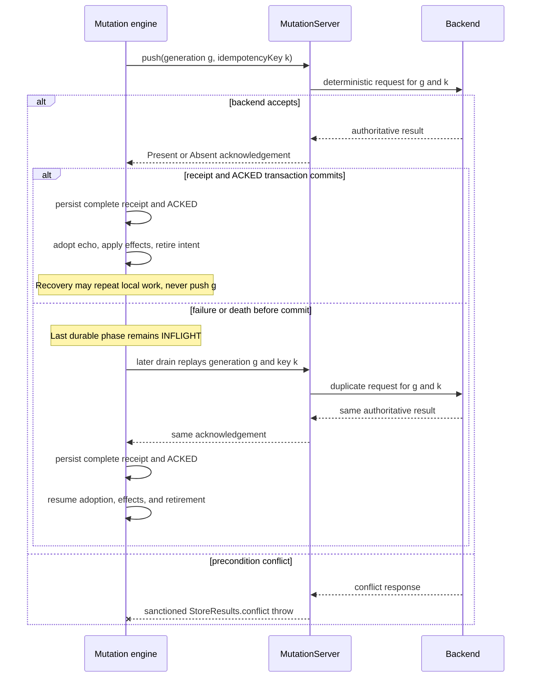

> Store 6 is in development and **nothing is published yet**. This page is the shape of the API as
> it stands on `main`; the install coordinates land with 6.0.0-alpha01.

<Callout type="Note">

**Experimental tier.** `store6-mutations` is a separate artifact in the 6.0.0-alpha01 floor, and
every public symbol carries `@ExperimentalStoreApi`. Its shapes may change or be removed in any
release. Read the [stability policy](/docs/store6/stability) before adopting it. The transport
contract is part of that experimental surface, so backend integrations must expect it to change.

</Callout>

<Callout type="Note">

**Remote acceptance is not yet durable acknowledgement.** If Store fails or dies before the local
acknowledgement-receipt transaction commits, the last durable phase remains `INFLIGHT`. A later
explicit drain may replay the same immutable generation and `idempotencyKey`; replay after process
death requires journal storage that survives restart. Once `ACKED` is durable, recovery may repeat
adoption, effects, and retirement, but it never re-pushes that generation. Every mutation endpoint
must therefore be idempotent. For one generation-stable `idempotencyKey`, duplicate success must
return the same authoritative presence, value, etag, and canonical target.

</Callout>

## The contract in two methods

`MutationServer<K, V>` is the application-owned transport boundary:

{/* snippet: mutations-server-interface */}
```kotlin
@ExperimentalStoreApi
public interface MutationServer<K : StoreKey, V : Any> {
    /**
     * Pushes one immutable attempt generation and returns the backend's acknowledgement.
     *
     * Retries of one [MutationPush.idempotencyKey] must be idempotent: a duplicate success must
     * return the same authoritative presence, value, etag, and canonical target. A thrown
     * `CancellationException` is rethrown by the library and leaves the in-flight generation
     * intact for exact replay.
     *
     * Backend coherence obligation for confirmed deletion, certified by returning
     * [MutationAbsentAck]: Every fetch begun after an Absent acknowledgement returns
     * `FetcherResult.Deleted`. Tombstones stop journal replay; they do not mask a backend that
     * violates this contract.
     */
    @ExperimentalStoreApi
    public suspend fun push(request: MutationPush<K, V>): MutationAck<K, V>

    /**
     * Confirms a monotonic retirement checkpoint so the backend can bound idempotency-receipt
     * retention.
     *
     * The returned [MutationRetirementAck.confirmedThroughSequence] must be monotonic and cannot
     * exceed [MutationRetirement.retiredThroughSequence]; the library validates both properties
     * and treats a violation as a protocol failure. The request/ack protocol is idempotent: a
     * later pass may resend the same or a greater prefix. A thrown `CancellationException` is
     * rethrown, leaves the server-confirmed prefix unchanged, and prunes nothing.
     */
    @ExperimentalStoreApi
    public suspend fun retire(request: MutationRetirement): MutationRetirementAck
}
```

Store builds the request carriers. Your implementation owns their deterministic wire encoding,
the backend call, and the conversion from a response into one of the public acknowledgement
carriers.

The following skeleton leaves HTTP mechanics in an app-specific client. That client must encode
the fields documented below rather than serializing the process-local `key` as backend identity.
It must also preserve `CancellationException`; neither layer should turn cancellation into a
response or another failure.

{/* snippet: mutations-server-http-adapter */}
```kotlin
@file:OptIn(org.mobilenativefoundation.store6.core.ExperimentalStoreApi::class)

import org.mobilenativefoundation.store6.core.StoreKey
import org.mobilenativefoundation.store6.core.StoreMeta
import org.mobilenativefoundation.store6.core.StoreNamespace
import org.mobilenativefoundation.store6.core.seam.StoreResults
import org.mobilenativefoundation.store6.mutations.MutationAbsentAck
import org.mobilenativefoundation.store6.mutations.MutationAck
import org.mobilenativefoundation.store6.mutations.MutationPresentAck
import org.mobilenativefoundation.store6.mutations.MutationPush
import org.mobilenativefoundation.store6.mutations.MutationRetirement
import org.mobilenativefoundation.store6.mutations.MutationRetirementAck
import org.mobilenativefoundation.store6.mutations.MutationServer

private class HttpUserKey(private val id: String) : StoreKey {
    override val namespace: StoreNamespace = StoreNamespace("users")
    override fun canonicalId(): String = id
}

private data class HttpUser(val id: String, val name: String)

private sealed interface PushResponse {
    data class Present(
        val authoritative: HttpUser,
        val etag: String?,
        val canonicalId: String?,
    ) : PushResponse

    data class Absent(val etag: String?) : PushResponse

    data class Conflict(
        val serverMeta: StoreMeta?,
        val message: String,
        val cause: Throwable? = null,
    ) : PushResponse
}

private interface UserMutationHttpClient {
    // Deterministically encode the documented carrier fields and route only by request.identity.
    suspend fun push(request: MutationPush<HttpUserKey, HttpUser>): PushResponse

    suspend fun retire(request: MutationRetirement): Long
}

private class HttpUserMutationServer(
    private val http: UserMutationHttpClient,
) : MutationServer<HttpUserKey, HttpUser> {
    override suspend fun push(
        request: MutationPush<HttpUserKey, HttpUser>,
    ): MutationAck<HttpUserKey, HttpUser> =
        when (val response = http.push(request)) {
            is PushResponse.Present ->
                MutationPresentAck(
                    authoritative = response.authoritative,
                    etag = response.etag,
                    canonicalKey = response.canonicalId?.let(::HttpUserKey),
                )

            is PushResponse.Absent ->
                MutationAbsentAck(etag = response.etag)

            is PushResponse.Conflict ->
                throw StoreResults.exception(
                    StoreResults.conflict(response.serverMeta, response.message),
                    response.cause,
                )
        }

    override suspend fun retire(
        request: MutationRetirement,
    ): MutationRetirementAck =
        MutationRetirementAck(
            confirmedThroughSequence = http.retire(request),
        )
}
```

No catch block is intentional. A `CancellationException` propagates unchanged. Other operational
exceptions propagate too, allowing Store to classify non-cancellation transport failures
correctly.

## What a push carries

`MutationPush<K, V>` is immutable and library-built for one semantic generation. Encode each field
deterministically:

| Field | Wire contract |
|---|---|
| `identity` | The exact namespace and canonical-id pair. This alone selects the backend entity and feeds preconditions and idempotency. |
| `key` | Process-local adapter context. Fields beyond its already-validated identity are non-authoritative and can differ after restart. |
| `clientId` | The stable installation or journal identity issuing the push. |
| `clientSequence` | The intent's durable per-client FIFO and watermark unit. |
| `retiredThroughSequence` | The contiguous retired prefix advertised opportunistically for backend receipt cleanup. |
| `mutationId` | The opaque public id used to correlate this push with inspection and events. |
| `generation` | The semantic attempt generation. The first generation is `1`; a merge persists `g + 1` rather than editing `g`. |
| `idempotencyKey` | Stable across every transport retry of this generation. A new semantic generation receives a new key. |
| `valueCodecVersion` | The value-codec version for this generation's frozen `base` and `mine`. |
| `base` | The frozen confirmed presence captured for the generation. It is always an existence or value precondition. |
| `mine` | The frozen locally projected presence to apply. |
| `baseMeta` | Optional frozen metadata that strengthens the precondition. `null` selects the existence or value precondition in `base`; it never means an unconditional write. |

A retry of the same generation carries the same defensively reconstructed `base`, `mine`,
`baseMeta`, advertised retired prefix, and `idempotencyKey`. Route by `identity`. Do not let another
field on the reconstructed `key` change the selected backend entity.

## Idempotency across the acknowledgement crash window

The backend can accept a push and return an acknowledgement before Store's local receipt transaction
atomically persists the complete receipt and `ACKED` phase. If Store fails or dies before that
commit, the last durable phase is `INFLIGHT`. A later explicit drain may replay the same immutable
generation and `idempotencyKey`. An across-process replay is possible only when the journal storage
survives restart. Once `ACKED` is durable, a later drain may repeat adoption, effects, or retirement,
but it never calls `push` for that generation again.

For each `idempotencyKey`, retain enough of the successful result to return the same acknowledgement
on a duplicate request. Equality here includes the acknowledgement variant, authoritative value
when present, etag, and canonical target. A changed payload is not a retry: conflict resolution
persists generation `g + 1` and its new idempotency key before sending it.



Transport cancellation is not a failed generation. Once `push` has entered `INFLIGHT`, Store
rethrows `CancellationException` and leaves the generation intact because remote acceptance is
uncertain. A later explicit drain sends the exact same immutable generation. Doing so after process
death requires journal storage that survived restart and another explicit drain after reopening.
Until it parks or retires, that uncertain generation prevents later keys in the same client namespace
from starting transport; keys in other namespaces remain eligible.

## Signalling a conflict

<Callout type="Note">

**A precondition conflict has exactly one spelling.** Throw it through the sanctioned core
construction door:

{/* snippet: mutations-server-conflict-signal */}
```kotlin
throw StoreResults.exception(
    StoreResults.conflict(serverMeta, message),
    cause,
)
```

</Callout>

For an HTTP integration, translate only the backend response that means “the frozen precondition
did not hold” into that exception. Any other non-cancellation throw from `push` is a `TRANSPORT`
failure, not a conflict. Conflict policy, merged generations, and the server-wins terminal are
covered in [Conflict resolution](/docs/store6/mutations/conflicts).

## Acknowledging: Present or Absent

`MutationAck<K, V>` is sealed. Only `MutationPresentAck` can carry a canonical key, so a canonical
target on confirmed absence cannot be constructed in the current API.

### Present acknowledgements

Return `MutationPresentAck(authoritative, etag, canonicalKey)` when the entity exists after the
push.

- `authoritative` is the backend-authoritative value written into Store's source of truth.
- `etag` is optional and is recorded by freshness bookkeeping.
- `canonicalKey` is an optional same-namespace redirect. `null` keeps the pushed identity.

The canonical target is part of the idempotency result. Replaying one generation's key must return
the same target, or Store parks the intent as a protocol violation. See
[Aliases and canonical rekeying](/docs/store6/mutations/aliases) for the redirect lifecycle.

### Absent acknowledgements

Return `MutationAbsentAck(etag)` when the entity has been deleted. Store adopts that result through
its `clear` path. This variant has no canonical key, so rekey-on-deletion is unrepresentable in
6.0.0-alpha01.

An Absent acknowledgement certifies a hard backend coherence obligation: every fetch begun after
the acknowledgement returns `FetcherResult.Deleted`. Store's tombstones stop journal replay, but
they do not hide a backend that later serves the deleted entity. The
[fetcher guide](/docs/store6/guides/fetchers) defines `FetcherResult.Deleted` on the read path.

## Retirement checkpoints

`retire` is a second idempotent protocol. Store sends a library-built
`MutationRetirement(clientId, retiredThroughSequence)`, and the backend returns
`MutationRetirementAck(confirmedThroughSequence)`.

The offered sequence is the current contiguous locally retired prefix. It never advances across
parked or active work. The confirmation tells Store the largest client sequence the backend has
durably confirmed as retired, allowing the backend to bound idempotency-receipt retention.

For every acknowledgement:

- `confirmedThroughSequence` must be greater than or equal to the previously persisted confirmed
  prefix.
- It must be less than or equal to the request's `retiredThroughSequence`.

Store validates both rules before persisting the new prefix. A regression or an acknowledgement
above the offered prefix is a `PROTOCOL` failure. A later pass may resend the same prefix or offer a
greater one.

If `retire` throws `CancellationException`, Store rethrows it, leaves the server-confirmed prefix
unchanged, and prunes nothing. Any other operational throw is a `TRANSPORT` failure.

---

*Last verified: 2026-08-12 · `main` @ `539614c0`, pre-6.0.0-alpha01*
